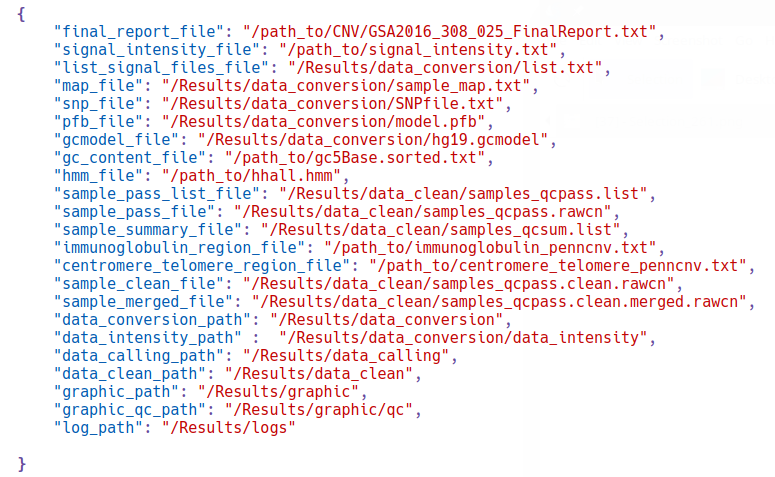
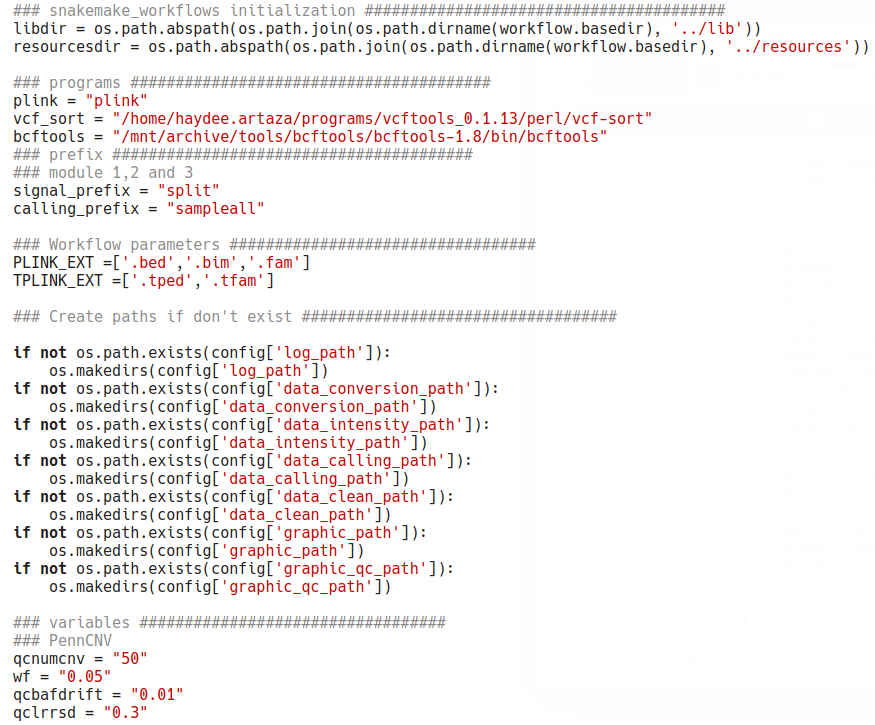

Rare CNVs Analysis Pipeline
======

Overwiew
-----------------------------
This pipeline is a generic bioinformatic solution to identify rare CNVs in case-control based studies. Using SNPs-array genotyping data, this pipeline performs the CNV detection and quality control, followed by the burden analysis, the rare CNV frequency analysis and the enrichment CNV analysis [see pipeline workflow](manual/images/Rare_CNV_pipeline-drawio.png).

Dependencies
-----------------------------
- Snakemake 5.22.1
- Python 3.8.5
- R 3.6.3

Installation
-----------------------------
1. Snakemake
Installation via Conda:
- conda install -n base -c conda-forge mamba
- mamba create -c conda-forge -c bioconda -n snakemake snakemake
- conda activate snakemake
Find other options in [Snakemake documentation](https://snakemake.readthedocs.io/en/stable/getting_started/installation.html)

2. R dependencies
``` r
#Install all libraries used in this pipeline
# Package names
packages <- c("ggplot2", "fmsb", "gridExtra", "dplyr", "reshape", "introdataviz")

# Install packages not yet installed
installed_packages <- packages %in% rownames(installed.packages())
if (any(installed_packages == FALSE)) {
  install.packages(packages[!installed_packages])
}
```
Pipeline Execution
-----------------------------
1. Download the git project:
```
$ git clone  https://github.com/haydeeartaza/RareCNVsAnalysis.git
```
2. Detection calls and QC analysis execution: 
```
$ cd qc-cnv
```
  2.1 Modify the config.json [(in qc-pipeline/snakefiles/config.json)](qc-cnv/qc-pipeline/snakefiles/config.json) to include the genotyping files path (report file and intensity signal file) and 
``` json
{
        "final_report_file": "/path_to/CNV/GSA2016_308_025_FinalReport.txt",
        "signal_intensity_file": "/path_to/signal_intensity.txt",
        "list_signal_files_file": "/Results/data_conversion/list.txt",
        "map_file": "/Results/data_conversion/sample_map.txt",   
        "snp_file": "/Results/data_conversion/SNPfile.txt",
        "pfb_file": "/Results/data_conversion/model.pfb",
        "gcmodel_file": "/Results/data_conversion/hg19.gcmodel",
        "gc_content_file": "/path_to/gc5Base.sorted.txt",
        "hmm_file": "/path_to/hhall.hmm",
        "sample_pass_list_file": "/Results/data_clean/samples_qcpass.list",
        "sample_pass_file": "/Results/data_clean/samples_qcpass.rawcn",
        "sample_summary_file": "/Results/data_clean/samples_qcsum.list",
        "immunoglobulin_region_file": "/path_to/immunoglobulin_penncnv.txt",
        "centromere_telomere_region_file": "/path_to/centromere_telomere_penncnv.txt",
        "sample_clean_file": "/Results/data_clean/samples_qcpass.clean.rawcn",
        "sample_merged_file": "/Results/data_clean/samples_qcpass.clean.merged.rawcn",
        "data_conversion_path": "/Results/data_conversion",
        "data_intensity_path" :  "/Results/data_conversion/data_intensity",
        "data_calling_path": "/Results/data_calling",
        "data_clean_path": "/Results/data_clean",
        "graphic_path": "/Results/graphic",
        "graphic_qc_path": "/Results/graphic/qc",
        "log_path": "/Results/logs"
    
}
```


  2.2 Modify the variables.py [(in qc-pipeline/snakefiles/variables.py)](qc-cnv/qc-pipeline/snakefiles/variables.py) to include the programs location, parameters and ouput paths.



  2.3 Excute the pipeline with the comman line:
```
$ snakemake -s qc-pipeline/snakefiles/qc.snake
```

3. Rare CNVs analysis execution:
```
$ cd association-cnv
```
Modify the config.json and variables.json files in association-pipeline/snakefiles, and then excute
```
$ snakemake -s association-pipeline/snakefiles/association.snake
```


Details about config, input/output files and a module/rule description see [user guide manual](manual/Rare_CNVs_pipeline_guide.pdf)

Pipeline Structure
-----------------------------
The pipeline consists of two major tasks: (1) quality control analysis, which uses the SNP-array genotyping data (green box) as an input to obtain good-quality samples and high-quality calls. (2) rare CNVs analysis, which takes samples and calls from the QC pipeline output, and after the data format conversion, performs the burden, rare CNVs and enrichment analysis. Black dotted lines split each analysis in their corresponding modules, purple boxes represent a specific task in each module, yellow boxes show representative outputs (files and/or plots), and the blue box represents external functions used by some modules. Dotted purple boxes are optional tasks which could be easily removed or changed to adapt the pipeline with the study requirements.


