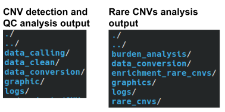
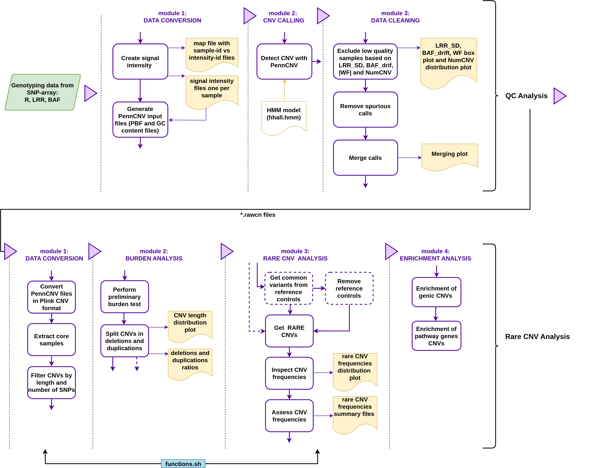

Rare CNVs Analysis Pipeline
======

Overwiew
-----------------------------
This pipeline is a generic bioinformatic solution to identify rare CNVs in case-control based studies. Using SNPs-array genotyping data, this pipeline performs CNV detection and quality control, followed by the burden analysis, rare CNV frequency analysis and CNV enrichment analysis [see pipeline workflow](manual/images/Rare_CNV_pipeline.png).

Dependencies
-----------------------------
- Mambaforge3
- Snakemake 5.22.1
- R (>=3.6.3)
- Python (>=3.8.5)
- BedTools
- plink (1.7)
- PennCNV (1.0.5)
- Gawk

Installation
-----------------------------
See Snakemake and dependencies installation [here](manual/INSTALL.md)

Pipeline Execution
-----------------------------
**1. Download the git project:**
```
$ git clone  https://github.com/haydeeartaza/RareCNVsAnalysis.git
```
**2. Detection calls and QC analysis execution:**
```
$ cd qc-cnv
```
- Modify config.json file [(in qc-pipeline/snakefiles/config.json)](qc-cnv/qc-pipeline/snakefiles/config.json)  including the genotyping files path (report file and intensity signal file) and specifying the ouput directory. In this example directory `data` should contain the SNP-array files, directory `QCResults` will contain all files generted in this pipeline and `RareCNVsAnalysis` refers to the directory containing the pipeline project.
``` json
{
    "final_report_file": "/data/GSA-24-v3-0-a1-demo-data-12_FinalReport.txt",
    "signal_intensity_file": "/data/SNPs_Table.txt",
    
    "gc_content_file": "/RareCNVsAnalysis/qc-cnv/resources/gc5Base.sorted.txt",
    "hmm_file": "/RareCNVsAnalysis/qc-cnv/resources/hhall.hmm",
    "immunoglobulin_region_file": "/RareCNVsAnalysis/qc-cnv/resources/immunoglobulin_penncnv.txt",
    "centromere_telomere_region_file": "/RareCNVsAnalysis/qc-cnv/resources/centromere_telomere_penncnv.txt",

    "list_signal_files_file": "/QCResults/data_conversion/list.txt",
    "map_file": "/QCResults/data_conversion/sample_map.txt",   
    "snp_file": "/QCResults/data_conversion/SNPfile.txt",
    "pfb_file": "/QCResults/data_conversion/model.pfb",
    "gcmodel_file": "/QCResults/data_conversion/hg19.gcmodel",
    "sample_pass_list_file": "/QCResults/data_clean/samples_qcpass.list",
    "sample_pass_file": "/QCResults/data_clean/samples_qcpass.rawcn",
    "sample_summary_file": "/QCResults/data_clean/samples_qcsum.list",
    "sample_clean_file": "/QCResults/data_clean/samples_qcpass.clean.rawcn",
    "sample_merged_file": "/QCResults/data_clean/samples_qcpass.clean.merged.rawcn",
   
    "data_conversion_path": "/QCResults/data_conversion",
    "data_intensity_path" :  "/QCResults/data_conversion/data_intensity",
    "data_calling_path": "/QCResults/data_calling",
    "data_clean_path": "/QCResults/data_clean",
    "graphic_path": "/QCResults/graphics",
    "graphic_qc_path": "/QCResults/graphics/qc",
    "log_path": "/QCResults/logs"
}
```
- Modify variables.py file [(in qc-pipeline/snakefiles/variables.py)](qc-cnv/qc-pipeline/snakefiles/variables.py) including programs location and setting files prefixes and PennCNV parameters. This pipeline will create the output directories specified in this file that were previously set in `config.json` file.
```python
  ### snakemake_workflows initialization ########################################
libdir = os.path.abspath(os.path.join(os.path.dirname(workflow.basedir), '../lib'))
resourcesdir = os.path.abspath(os.path.join(os.path.dirname(workflow.basedir), '../resources'))

### programs ########################################
#Include here all programs and versions.You can run the specific program/version
#calling it as {program_version} inside the code. E.g {R_3_4}
pennCNV = "/home/haydee.artaza/programs/PennCNV-1.0.5"
R_4_1 = "/home/haydee.artaza/programs/R_4_1"
### prefix ########################################
### module 1,2 and 3
signal_prefix = "split"
calling_prefix = "sampleall"

### Workflow parameters ##################################
### File extensions
PLINK_EXT =['.bed','.bim','.fam']
TPLINK_EXT =['.tped','.tfam']
### PennCNV
qcnumcnv = "50"
wf = "0.05"
qcbafdrift = "0.01"
qclrrsd = "0.3"

### Create paths if don't exist ###################################

if not os.path.exists(config['log_path']):
    os.makedirs(config['log_path'])
if not os.path.exists(config['data_conversion_path']):
    os.makedirs(config['data_conversion_path'])
if not os.path.exists(config['data_intensity_path']):
    os.makedirs(config['data_intensity_path'])
if not os.path.exists(config['data_calling_path']):
    os.makedirs(config['data_calling_path'])
if not os.path.exists(config['data_clean_path']):
    os.makedirs(config['data_clean_path'])
if not os.path.exists(config['graphic_path']):
    os.makedirs(config['graphic_path'])
if not os.path.exists(config['graphic_qc_path']):
    os.makedirs(config['graphic_qc_path'])
```
- Excute the pipeline with the comman line:
```
$ conda activate snakemake
$ snakemake -s qc-pipeline/snakefiles/qc.snake --core 1
```
**3. Rare CNVs analysis:**
```
$ cd association-cnv
```
Modify the config.json file in association-pipeline/snakefiles. In this example directory `QCResults` refers the directory with the QC and detection calls results, directory `RareCNVsResults` will contain all files generted in this pipeline and `Resources` refers to the directory containing the input files for this pipeline.
``` json
{
    "map_file": "/QCResults/data_conversion/sample_map.txt",
    "sample_all_file": "/QCResults/data_calling/sampleall.rawcn",
    "sample_merged_file": "/QCResults/data_clean/samples_qcpass.clean.merged.rawcn",

    "controls_random_file": "/Resources/controls_random_sampling.txt",
    "genes_ref_file": "/Resources/enrichment/glist-hg19.dat",
    "core_file": "/Resources/21h_positive_core.txt",
    "pathway_file": "/Resources/enrichment/PanelApp/panelApp_AI_genes.dat",
    "allpheno_file": "/Resources/ALL_phenotypes_09052019.tsv",

    "data_conversion_path": "/RareCNVsResults/data_conversion",
    "burden_analysis_path": "/RareCNVsResults/burden_analysis",
    "burden_temp_path": "/RareCNVsResults/burden_analysis/temp",
    "burden_graph_path": "/RareCNVsResults/graphics/burden_analysis",
    "rare_cnvs_path": "/RareCNVsResults/rare_cnvs",
    "rare_cnvs_summary_path": "/RareCNVsResults/rare_cnvs/summary",
    "rare_cnvs_reference_path": "/RareCNVsResults/rare_cnvs/Reference",
    "rare_cnvs_reference_summary_path": "/RareCNVsResults/rare_cnvs/Reference/summary",
    "rare_cnvs_forplots_path": "/RareCNVsResults/rare_cnvs/forplots",
    "rare_cnvs_graph_path": "/RareCNVsResults/graphics/rare_cnvs",
    "enrichment_rare_cnvs_path": "/RareCNVsResults/enrichment_rare_cnvs",
    "enrichment_rare_cnvs_genic_path": "/RareCNVsResults/enrichment_rare_cnvs/genic_CNVs",
    "enrichment_rare_cnvs_pathway_path": "/RareCNVsResults/enrichment_rare_cnvs/pathway_CNVs",
    "log_path": "/RareCNVsResults/logs"
 
}
```
**NOTE:**
> **Phenotype** file should containt the the case/control and gender information in columns 3 and 7 respectivelly, as is shown in the example below. Function `create_fam_file` in [functions.sh](association_cnv/lib/functions.sh) can be modified to adjust these positions.
```
NAT REG	CAT PID     FID AGE SEX
A   1   1   NA06985 0   10  1
B   2   2   NA12717 0   25  2
C   3   1   NA12873 0   45  1
D   4   2   NA12891 0   15  2
```
- Excute the pipeline with the comman line:
```
$ snakemake -s association-pipeline/snakefiles/association.snake --core 1
```  


Details about config, input/output files and a module/rule description see [user guide manual](manual/Rare_CNVs_pipeline_guide.pdf)

Test
-----------------------------
See test instructions [here](test/Test.md)

Publication and Citation
-----------------------------
This project is provisionally described in [Artaza H. *et al.*, doi:10.1101/2024.03.13.584428](https://doi.org/10.1101/2024.03.13.584428)

Pipeline Structure
-----------------------------
The pipeline executes two major tasks:

1. Quality control analysis, which uses SNP-array genotyping data (green box) as an input to obtain high-quality samples and CNV calls. 
2. Rare CNV analysis, which takes samples and CNV calls from the QC pipeline output, and after the data format conversion, consists of burden, rare CNV and enrichment analysis. 

Black dotted lines split each analysis in their corresponding modules, purple boxes represent a specific task in each module, yellow boxes show representative outputs (files and/or plots), and the blue box represents external functions used by some modules. Dotted purple boxes are optional tasks which could be easily removed or changed to adapt the pipeline with the study requirements.


